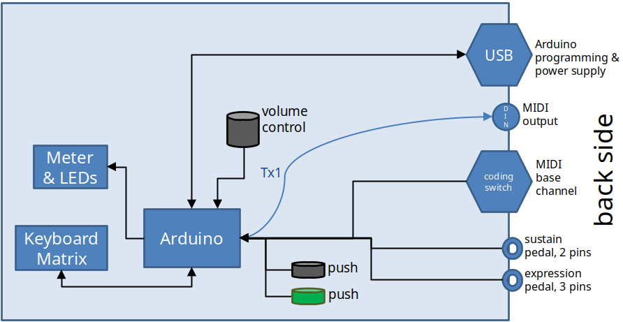
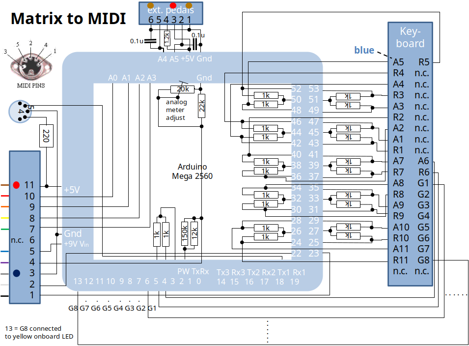
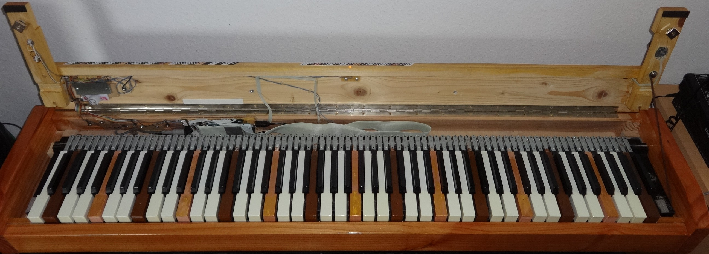
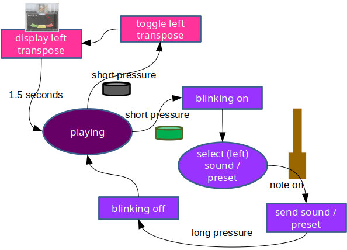

## MIDI Controller mit Keyboard Diodenmatrix

Dieses Archiv enthält Dokumentation und Arduino-Quellcode zum Bau eines MIDI Instruments mit 6+6 Tastatur, die über eine Diodenmatrix abgefagt wird.

Die Diodenmatrix basiert auf 8 Sammelleitungen und jeweils 11 Leitungen für Arbeits- und Ruhekontakte. Damit kann die Tastatur maximal 8x11=88 Tasten besitzen. Solche Matrizen wurden zum Beispiel in FATAR Tastaturen, die in Doepfer Masterkeyboards integriert wurden, eingesetzt.

Die Unterstützung anderer Tastaturen ist möglich, erfordert aber eine Code-Anpassung.

Ursprünglich als reines MIDI Keyboard mit hochwertiger Tastatur geplant hat sich das Projekt weiter entwickelt. Ein MIDI Modul, hier ein V3 Sound Grand Piano XXL, kann spezifisch angesteuert werden. Ein Keyboard-Splitpunkt wird unterstützt. Gesendet wird auf bis zu 3 MIDI Kanälen. Unterstützung anderer MIDI Module ist möglich, erfordert aber eine Code-Anpassung.

## Blockschaltbild und Anschlüsse

### Ein- und Ausgänge

- 5-pol. DIN Buchse MIDI Ausgang
- 6,3 mm Mono-Klinkenbuchse für Haltepedal
- 6,3 mm Stereo-Klinkenbuchse für Schwellerpedal
- USB Typ B Buchse für Arduino-Programmierung oder Stromversorgung. Praktisch: wird tatsächlich ein V3 Sound Modul verwendet, dann kann dessen USB Anschluss, der vom Herstellen eigentlich für einen Bluethooth-Stick vorgesehen ist, das MIDI Keyboard mit Strom mitversorgen.

### Bedienelemente

- Stufenschalter zur Festlegung der MIDI-Kanäle
- Drehregler rechts für Gesamtlautstärke
- Ein schwarzer und ein grüner Taster links
- Ein Zeigerinstrument mit schaltbarer Hintergrundbeleuchtung (weiße LED)
- Eine orange LED über der Tastaturmitte
- Die Tastatur selbst

## Schaltpläne

Zentraler Bestandteil der Elektronik ist ein Arduino Mega 2560 Board. Nur wenige Bauteile sind notwendig zur Anpassung an die Peripherie. Je Arbeits- und Ruhekontaktleitung der Tastaturmatrix wird ein 1 kOhm Widerstand benötigt.

Der Maximalausschlag des Zeigerinstruments kann mit Hilfe eines Trimmers justiert werden.

Die Pegel der externen Pedale werden über Kondensatoren leicht geglättet. Der 1,2 kOhm Widerstand schützt vor Kurzschlüssen, denn an der Buchse für das Schwellerpedal finden sich sowohl +5V als auch Masse. Das Schwellerpedal muss hochohmig sein, damit der 1,2 kOhm Widerstand nicht die Vollaussteuerung verhindert.

Besonderheit: Zur Einsparung von Arduino-Eingängen wird die Stellung des Codierschalters mittels 5 Widerständen D/A-gewandelt. Die Software reduziert den am Analogeingang gemessenen, 1024 Werte feinen digitalen Wert wieder in eine Schalterstellung von 0 bis 9.

Die weiße LED ist die Hintergrundbeleuchtung des Zeigerinstruments, die orangene die über der Tastatur.

Das von mir verwendete Schwellerpedal von Dr. Böhm enthält ein logarithmisches 180° Potentiometer mit 470 kOhm. Die Software muss zurückrechnen. Im [Code](Matrix_to_MIDI.ino) vorgesehen ist aber auch der Anschluss linearer Potentiometer (siehe die Bedingung um den Aufruf von `delog()`).

## Hardware

Alles zusammen ist in einem selbstgebauten Holzgehäuse untergebracht. Die Tastatur kann zu Wartungszwecken ohne Werkzeug ausgebaut werden. Die obere Klappe wird lediglich durch 2 quadratische Permanentmagnete links und rechts geschlossen gehalten. Sie kann von Hand durch einen gewissen Krafteinsatz geöffnet werden.

Die Tastatur wird durch 2 Klemmblöcke links und rechts fixiert. Bei geöffneter Klappe lassen sich diese Holzblöcke nach oben entnehmen. Danach kann die Tastatur nach hinten bis zum Anschlag geschoben und nach oben herausgenommen werden.

Arduino- mit Mother-Board (Lochrasterplatine) befinden sich stehend in der linken Hälfte. Um die zusammengesteckten Boards zu entnehmen müssen alle Steckverbinder zum Mother-Board gelöst werden. Die Boards werden nur durch die geschlossene Klappe fixiert und können bei geöffneter Klappe vorsichtig nach oben entnommen werden. Ein Ausbau der Tastatur ist nicht notwendig.

Dies ist das mit Abstand wartungsfreundlichste Keyboard, das ich in meinem Musikerleben hatte, und es gab derer nicht wenige.

## Bedienung

### MIDI-Kanäle einstellen

Das Instrument sendet auf bis zu 3 aufeinanderfolgenden MIDI Kanälen, die über den Codierschalter einzustellen sind. Der Codierschalter wird nur beim Hochfahren ausgelesen. Für den Wechsel der MIDI Kanäle muss das Instrument also aus- und wieder eingeschaltet werden.

#### Ohne Split

Nach dem Einschalten ist die Tastatur nicht geteilt. Das Instrument sendet auf dem Kanal, der am Codierschalter eingestellt wurde. Dabei fängt MIDI bei 1 an zu zählen und der Codierschalter bei 0. Das Haltepedal bestimmt den _Sustain_ Wert, der Schweller den _Expression_ Wert. Oft bestimmt der _Expression_ Controller die Lautstärke, das hängt vom MIDI Modul und dessen Einstellungen ab.

*Beispiel: Der Codierschalter steht auf 4, dann wird auf MIDI-Kanal 5 gesendet.*

#### Mit Split

Das Instrument sendet auf 3 aufeinanderfolgenden Kanälen. Der linke Tastaturbereich sendet auf dem 1. der Kanäle, der rechte Tastaturbereich sendet auf dem 2. und 3. der Kanäle. Der Schweller regelt den _Expression_ Wert auf dem 2. der Kanäle.

*Beispiel: Der Codierschalter steht auf 2, dann sendet der linke Tastaturbereich auf MIDI-Kanal 3, der rechte Tastaturbereich sendet parallel auf den Kanälen 4 und 5. Der Schweller regelt nur Kanal 4.*

Im Splitmodus hat man normalerweise links und rechts verschiedene Sounds. Mit dem Schweller lässt sich auf der rechten Seite ein weiterer, dritter Sound als _Layer_ hinzuregeln. Natürlich kann man auf dem 3. der Kanäle auch einen stummen Sound einstellen und trotzdem mit dem Schweller den 2. der Kanäle regeln.

##### Transponierung

Der rechte Tastaturbereich transponiert fest um -12.

Der linke Tastaturbereich transponiert zunächst nicht. Diese Einstellung eignet sich dazu, mit der linken Hand Bass zu spielen. Da beim monophonen Bassspiel _Sustain_ so gut wie nie benötigt wird, sendet das Haltepedal auf dem 2. und den 3. der Kanäle, also für den rechten Bereich.

Der linke Bereich kann auf eine Transponierung +12 umgeschaltet werden. Diese Einstellung eignet sich dazu, mit der linken Hand Akkorde zu spielen. Das Haltepedal sendet dann auf dem 1. der Kanäle, also für den linken Bereich.

### Globale Anschlagsdynamik einstellen

Durch langes Drücken (> 2,5 Sekunden) des schwarzen Tasters gelangt man in den Justiermodus für die globale Anschlagsempfindlichkeit. Das Zeigerinstrument wird beleuchtet und zeigt den eingestellten Wert an. Drückt man eine Taste, wird die MIDI _Velocity_ angezeigt, wie sie über MIDI gesendet wird. Dem Vollausschlag des Zeigers entspricht ein Wert von 127. Nach Loslassen der Taste wird wieder die eingestellte globale Empfindlichkeit angezeigt. Der Empfindlichkeitswert kann mit dem grünen Taster schrittweise vermindert und mit dem schwarzen Taster erhöht werden.

Diese Funktion ist zur Anpassung an das verwendete MIDI Modul gedacht.

Um den Justiermodus zu verlassen muss der schwarze Taster nochmals lange gedrückt werden.

### Anschlagsdynamik je Taste justieren

Durch langes Drücken (> 2,5 Sekunden) des grünen Tasters gelangt man in den Feinjustiermodus. Die Empfindlichkeit lässt sich je Taste nachjustieren. Oft sind Ober- und Untertasten aufgrund der Bauweise der jeweiligen Tastatur verschieden zu justieren. Drückt man eine Taste, wird die MIDI _Velocity_ angezeigt, wie sie über MIDI gesendet wird. Dem Vollausschlag des Zeigers entspricht ein Wert von 127. Nach Loslassen der Taste wird die eingestellte Empfindlichkeit der Taste angezeigt. Der Empfindlichkeitswert kann mit dem grünen Taster schrittweise vermindert und mit dem schwarzen Taster erhöht werden.

Diese Funktion ist zur Anpassung an die verwendete Tastatur gedacht.

Um den Feinjustiermodus zu verlassen muss der grüne Taster nochmals lange gedrückt werden.

### Keyboard Split

Durch gleichzeitiges (kurzes) Drücken beider Taster lässt sich ein Splitpunkt festlegen. Die orangene LED blinkt, bis eine Taste gedrückt wird. Die gedrückte Taste legt den Splitpunkt fest. Im Splitmodus leuchtet die orangene LED heller.

Um den Splitmodus zu verlassen müssen wieder beide Taster gleichzeitig gedrückt werden. Die orangene LED leuchtet nun dunkler, so wie nach dem Einschalten.

#### Transponierung linker Bereich

Im Splitmodus lässt sich die Transponierung des linken Bereichs zwischen 0 und +12 umschalten. Dazu ist der schwarze Taster kurz zu drücken. Das Zeigerinstrument wird für 1,5 Sekunden beleuchtet und meldet die eingestellte Transponieren zurück, das heißt der Zeiger befindet sich entsprechend am linken oder am rechten Anschlag.

### V3 Grand Piano Ansteuerung
Unterstützt wird das Einstellen von

- Sounds mittels Bank Select und Program Change Nachrichten.
- Registrierungen im Sinne von V3 Sound Registrierungen für die bis zu 3 Kanäle im Splitmodus.

#### Sounds

Ohne Splitpunkt kann keine Registrierung eingestellt werden. Es können auch keine Sounds aus der Bass-Gruppe (grün) eingestellt werden.

Nach kurzem Drücken des grünen Tasters lässt sich ein Sound auswählen. Die orangene LED blinkt, bis eine Taste aus dem linken Bereich gedrückt wird. Die gedrückte Taste wählt den Sound aus. Die Sounds sind im [Quellcode](V3GrandPianoXXL.h) festzulegen. Aufkleber helfen beim Finden der zu drückenden Taste.

Die Namen der Sounds wurden denen aus dem V3 Handbuch entlehnt, z.B. _GP Hamburg_ für _Grand Piano Hamburg_ oder _Upright Bs_ für _Upright Jazz Bass_.

#### Registrierungen

Eine Registrierung[^1] besteht aus 3 Presets, ein Preset besteht derzeit aus

- Bank Select + Program Change
- Channel Volume
- Coarse Tuning
- Reverb Level
- Choruse Level
- Attack
- Decay
- Release
- Cutoff Frequency

[^1]: Anders als im Nachbarprojekt _Keyboard Controller_ bietet eine Registrierung derzeit noch nicht die Möglichkeit, andere Hall- oder Effekttypen einzustellen.

Nach kurzem Drücken des grünen Tasters lässt sich eine Registrierung auswählen. Die orangene LED blinkt, bis eine Taste gedrückt wird. Eine gedrückte Taste ab der Tastaturmitte wählt die Registrierung aus. Die Registrierungen sind im [Quellcode](V3GrandPianoXXL.h) festzulegen. Aufkleber helfen beim Finden der zu drückenden Taste. Die Registrierungen wurden nach den Musiktiteln benannt, wo sie erstmalig zum Einsatz kamen, z.B. _Ain't No Sunshine_.

Wird bei blinkender LED eine Taste gewählt, die einen Sound auswählt (linke Tasten) und nicht eine Registrierung, dann betrifft dies den 1. der Kanäle, also den linken Bereich. So lässt sich zum Beispiel im Splitmodus nach Auswahl der Registrierung nachträglich der Bass- (kein Transpose) oder Begleit-Sound (bei Transpose +12) ändern.

### Zustandsdiagramme
#### Einschalten, Justieren, Split festlegen
Nach dem Einschalten wird nach einigen Sekunden der _Normalzustand_ `playing` erreicht. Alle anderen Zustände wird man nur von Zeit zu Zeit besuchen.

#### Transponieren und Sound/Preset auswählen
`playing` ist identisch mit dem bereits erwähnten Normalzustand. Um das obige Diagramm nicht zu überfrachten, wurde dieses weitere Diagramm erstellt.

