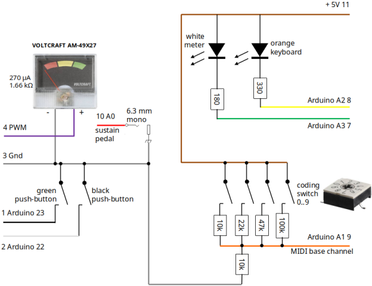
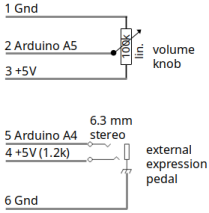

## MIDI Controller mit Keyboard Diodenmatrix

Dieses Archiv enthält Dokumentation und Arduino-Quellcode zum Bau eines MIDI Instruments mit 6+6 Tastatur, die über eine Diodenmatrix abgefagt wird. Die Diodenmatrix basiert auf 8 Sammelleitungen und jeweils 11 Leitungen für Arbeits- und Ruhekontakte. Solche Matrizen wurden zum Beispiel in FATAR Tastaturen, die in Doepfer Masterkeyboards integriert wurden, eingesetzt.

Die Unterstützung anderer Tastaturen ist möglich, erfordert aber eine Code-Anpassung.

Ursprünglich als reines MIDI Keyboard mit hochwertiger Tastatur geplant hat sich das Projekt weiter entwickelt. Ein MIDI Modul, hier ein V3 Sound Grand Piano XXL, kann angesteuert werden. 1 Keyboard Splitpunkt wird unterstützt. Gesendet wird auf bis zu 3 MIDI Kanälen. Unterstützung anderer MIDI Module ist möglich, erfordert aber eine Code-Anpassung.

## Blockschaltbild und Anschlüsse

### Ein- und Ausgänge

- 5-pol. DIN Buchse MIDI Ausgang
- 6,3 mm Mono-Klinkenbuchse für Haltepedal
- 6,3 mm Stereo-Klinkenbuchse für Schwellerpedal
- USB Typ B Buchse für Arduino-Programmierung oder Stromversorgung. Praktisch: über ein USB-Kabel kann das V3 Sound Modul statt des vorgesehenen Bluethooth-Sticks das MIDI Keyboard mit Strom versorgen.

### Bedienelemente

- Stufenschalter zur Festlegung der MIDI-Kanäle
- Drehregler für Gesamtlautstärke
- Ein schwarzer und ein grüner Taster
- Ein Zeigerinstrument mit schaltbarer Hintergrundbeleuchtung (weiße LED)
- Eine orange LED über der Tastatur
- Die Tastatur selbst

## Schaltpläne

Zentraler Bestandteil der Elektronik ist ein Arduino Mega 2560 Board. Nur wenige Bauteile sind notwendig zur Anpassung an die Peripherie. Je Arbeits- und Ruhekontaktleitung wird ein 1 kOhm Widerstand benötigt.

Der Maximalausschlag des Zeigerinstruments kann mit Hilfe eines Trimmers eingestellt werden.

Die Pegel der externen Pedale werden über Kondensatoren leicht geglättet. Der 1,2 kOhm Widerstand schützt vor Kurzschlüssen. Denn das Schwellpedal wird mit +5V versorgt. Das Schwellerpedal muss hochohmig sein, damit der 1,2 kOhm Widerstand nicht die Vollaussteuerung verhindert.

Besonderheit: Zur Einsparung von Arduino-Eingängen wird die Stellung des Codierschalters mittels 5 Widerständen analogisiert. Die Software digitalisiert den am Analogeingang gemessenen Wert wieder in eine Schalterstellung 0 bis 9.

Die weiße LED ist die Hintergrundbeleuchtung des Zeigerinstruments, die orangene die über der Tastatur.

Das Schwellerpedal von Dr. Böhm enthält ein logarithmisches 180° Potentiometer mit 470 kOhm. Die Software muss zurückrechnen. Im Code vorgesehen ist aber auch der Anschluss linearer Potentiometer.

## Bedienung

### MIDI-Kanäle einstellen

### Globale Anschlagsdynamik einstellen

### Anschlagsdynamik je Taste justieren

### Keyboard Split

#### Transponierung linker Bereich

### Haltepedal

### Schwellerpedal

### V3 Grand Piano Ansteuerung

### Statusdiagramme

